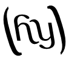

Welcome to Hy's documentation!
==============================

Welcome to `Hy <https://github.com/paultag/hy>`_!
Hy is a wonderful dialect of Lisp that's embedded in Python.
Since Hy transforms its lisp code into the python Abstract Syntax
Tree, you have the whole beautiful world of python at your fingertips,
in lisp form!

Meet our mascot, "Cuddles":

.. image:: http://fc07.deviantart.net/fs70/i/2013/138/f/0/cuddles_the_hacker_by_doctormo-d65l7lq.png
   :alt: Paul riding cuddles into the distance

..   Our old ascii art mascot version
..   Retained as an easter egg for those who read the docs via .rst!
..
..   LET'S CUDDLEFISH
..              ______
..       _.----'#'  # '
..     ,'  #'    ,#  ;
..    ('   (w)  _,-'_/
..   /// / /'.____.'
..   \|\||/

Read more about Hy in these docs!  Or, if you'd like, try the
`interactive hy->python demo <http://hy.pault.ag/>`_!

We're also on IRC!  Join
`#hy on irc.freenode.net <http://webchat.freenode.net/?channels=hy>`_!

Documentation Index
===================

Contents:

.. toctree::
   :maxdepth: 3

   quickstart
   hacking
   tutorial
   language/index
